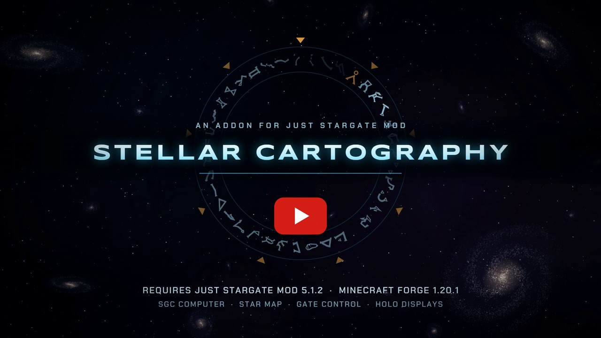
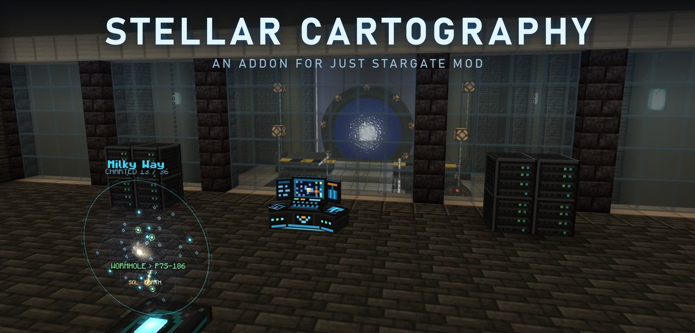
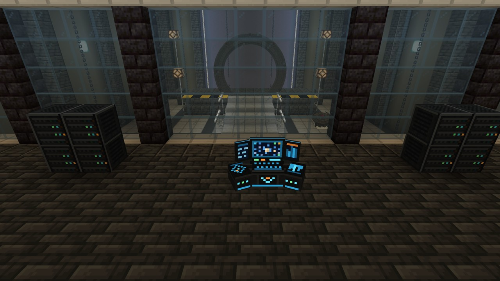
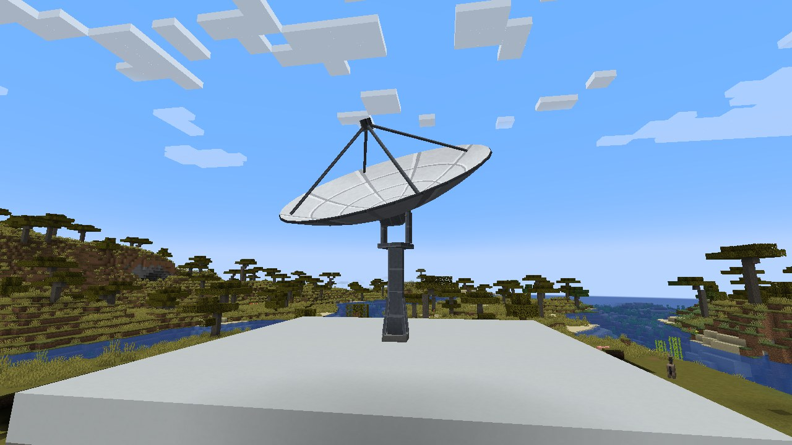
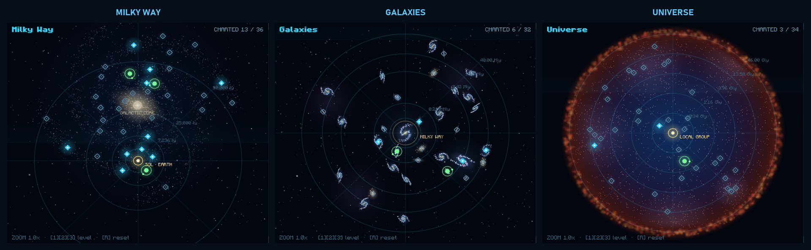
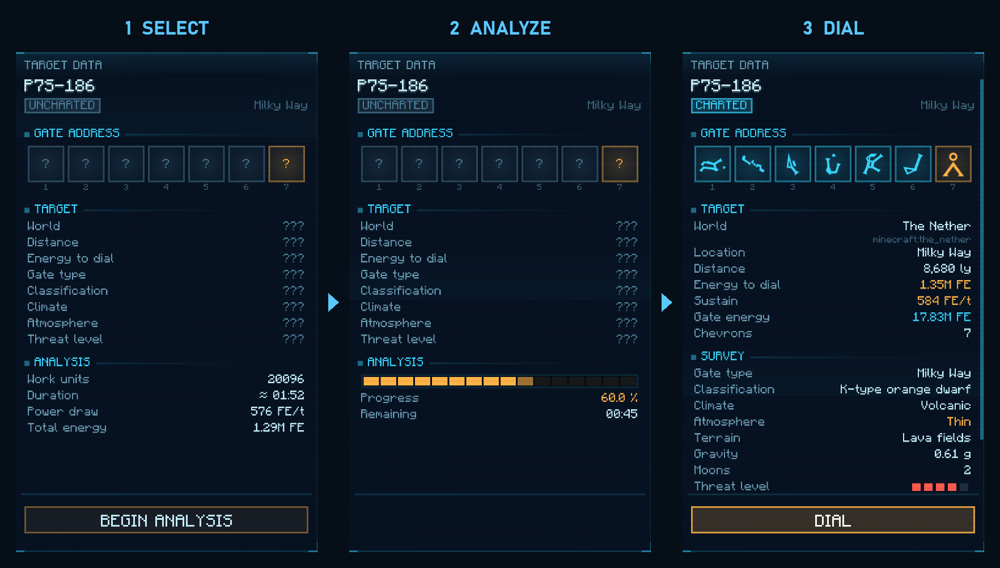
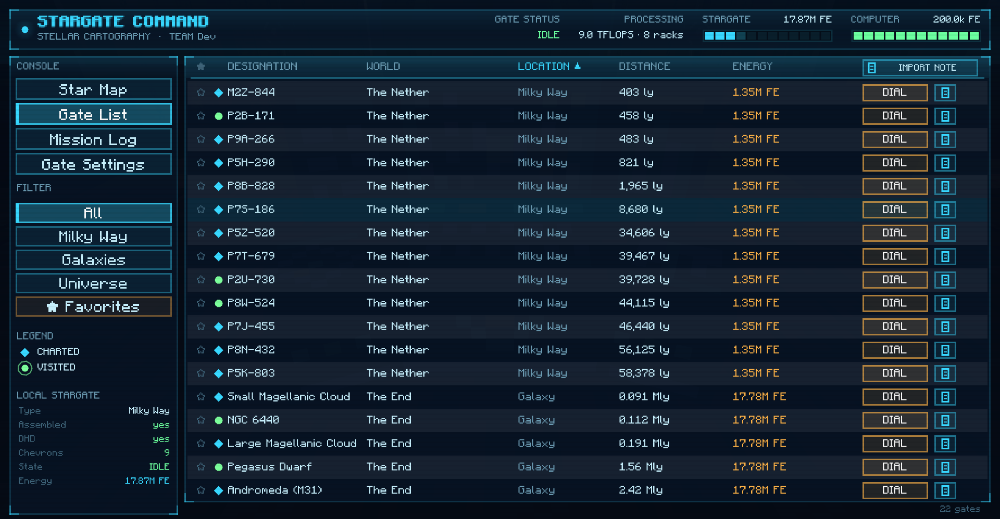
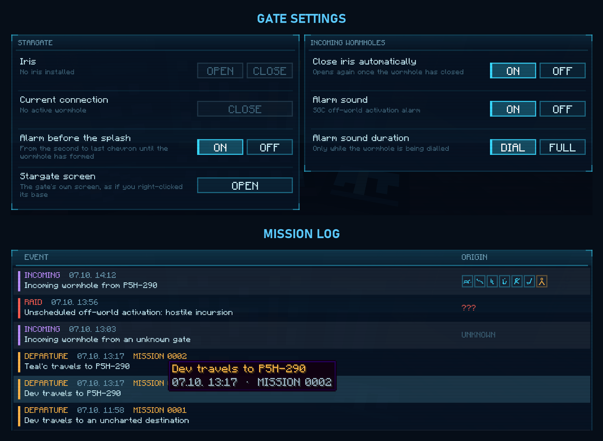
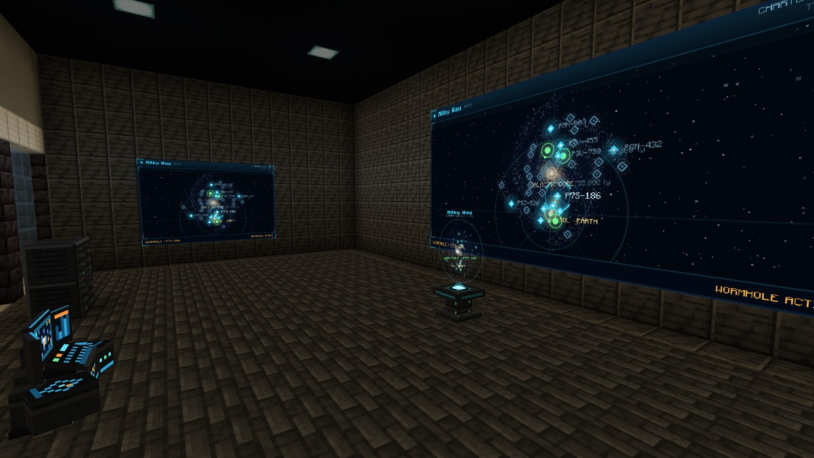

> This readme describes **version 0.21.4**. If you play an older version, some of the features and settings described
> here may not exist yet.

# JSG: Stellar Cartography

**Stellar Cartography** brings the control room of Stargate Command to **Just Stargate Mod**.
Build an SGC computer next to your Stargate, research distant worlds on a star map spanning the Milky Way, other
galaxies and the whole universe, reveal their gate addresses and dial them with a single click.

Every destination on the map leads to a real dimension of your world, so the map grows with your modpack. Progress is
shared within your team.

**Requires:** Minecraft 1.20.1 · Forge 47 · Just Stargate Mod 5.1.2  
**Optional:** FTB Teams · Stargate Odyssey Core

---

## Features

### SGC Computer & Server Racks

- The **SGC Computer** is a two-block wide console. Place it near your Stargate and its DHD (within 16 blocks),
  power it with FE from any side and right-click it to open the console.
- **Server Racks** add computing power and speed up research. They only need to stand within 8 blocks of the
  computer (also above or below), they don't have to touch it. Up to 16 racks count.
- Racks make research faster, not more expensive: a destination always costs the same total energy.
- A **Satellite Dish** lets the computer analyze at all: the **small** dish unlocks Milky Way destinations, the
  **medium** one also the Galaxies level, the **large** one every level up to the Universe. Dishes add no computing
  power. A dish only needs to stand within 20 blocks of the computer; each computer uses one dish.

### The Star Map

- Three map levels: the **Milky Way** (light years), **Galaxies** like Andromeda or the Pegasus Dwarf (millions of
  light years) and the **Universe** of superclusters (billions of light years).
- The map is generated from your world seed, so every world has its own.
- Destinations you haven't researched yet only show "???".
- **Galaxies** and **Universe** unlock once the DHD of the nearby Stargate has a **DHD Glyph Crystal** (8/9 chevrons),
  or when the computer is linked to a Universe Stargate.
- Marker colours show what you know: uncharted, charted, visited (someone of your team travelled there) and
  being analysed.

### Research & Dialing

1. **Select** an uncharted destination. The console shows how long the analysis takes and how much energy it needs.
2. **Analyze** it (with a big enough satellite dish). The computer uses FE while it works; more racks make it faster.
3. **Dial**: a charted destination reveals its gate address, world, distance, the energy your gate needs to dial and survey
   data like climate, atmosphere and threat level. One click on **DIAL** lets your Stargate dial it.

The first destination of a dimension leads to its main Stargate. Every further one gets a Stargate of its own, far away
from all others, so it feels like a new world. If the computer stands in another dimension than the
Overworld, the map marks its location and measures all distances from there.

### Gate List & Notebook Pages

- The **Gate List** shows every known destination with distance and dialing energy. Sort it, filter it by map level
  and dial directly from the list.
- Click the **star** to mark a favourite. Favourites stay on top and have their own filter.
- **Export** an address onto a JSG notebook page (uses an empty page from your inventory) to share it with others.
- **Import** a written notebook page to add any registered gate to the list, also gates built by players. Imported
  gates need no research.

### Gate Control & Mission Log

- **Gate Settings** control the nearby Stargate: open or close the iris, close your own wormhole and open JSG's
  Stargate screen from the console.
- **Alarms** like in the series: an alarm before the splash when you dial out, and the off-world activation alarm for
  incoming wormholes (until the wormhole is formed or until it closes).
- **Automatic iris:** closes the iris for every incoming wormhole and opens it again afterwards.
- The **Mission Log** records analyses, departures (numbered missions, who went where), incoming wormholes and raids.
  It keeps the last 200 entries and stays in the computer when you break it.

### Holo Map Table & Wall Screens

- The **Holo Map Table** projects the star map as a hologram, the **Holo Wall Screen** shows it on the wall. Both
  connect to the nearest SGC computer within 16 blocks.
- Wall screens placed next to each other in a rectangle (up to 16 × 9) merge into one big screen.
- Right-click to switch the view: *Automatic* follows the computer (the dialed or analysed destination), or pick a map level.
  Wall screens can also show the mission log. Sneak + right-click shows which computer a display is linked to.
- Active analyses and wormholes appear live on every display.

### Teams & Compatibility

- **FTB Teams:** research, favourites and imported gates are shared by the whole team. Without FTB Teams, every
  player has their own progress.
- **Stargate Odyssey Core:** the map uses the pack's dimension groups (Milky Way, Pegasus, Destiny) as map levels and
  unlocks them with the pack's 8- and 9-Symbol Crystals.
- **Stargate outposts** that JSG generates get the gate type of their map level: Milky Way gates in the Milky Way,
  Pegasus gates on the Galaxies level and Universe gates on the Universe level.

---

## Configuration

### Server config

`saves/<world>/serverconfig/jsgstellarcartography-server.toml` (on a dedicated server: `world/serverconfig/`).
Copy it to `defaultconfigs/` to use it for every new world. All multipliers default to `1.0`.

**Energy**

| Setting | Default | What it does |
|---|---|---|
| `capacity` | `200000` | FE the computer can store. |
| `maxReceive` | `4000` | FE the computer accepts per tick. |
| `researchBasePerTick` | `64` | FE per tick the computer uses while researching. Every rack uses the same amount per work unit it adds. |

**Research**

| Setting | Default | What it does |
|---|---|---|
| `computeBase` | `1.0` | Work units per tick the computer itself contributes. |
| `computePerRack` | `1.0` | Work units per tick each server rack adds. |
| `maxRacks` | `16` | Maximum number of racks a computer uses. |
| `rackRadius` | `8` | How far (in blocks, every direction) a rack may be from the computer. |
| `requireDish` | `true` | Analyses need a satellite dish: small for the Milky Way, medium for Galaxies, large for the Universe. |
| `dishRadius` | `20` | How far (in blocks, as a sphere) a satellite dish may be from the computer. |
| `workMilkyWay` | `24000` | Work to research a Milky Way destination (24000 = 20 minutes without racks). |
| `workGalaxies` | `96000` | Work to research a destination on the Galaxies level. |
| `workUniverse` | `288000` | Work to research a destination on the Universe level. |
| `workVariance` | `0.25` | Random variation of the work per destination (0.25 = ±25 %). |
| `timeMultiplier` | `1.0` | Multiplies the research time (`2.0` = twice as long). |
| `costMultiplier` | `1.0` | Multiplies the FE used while researching (`0` = free). |

**Map**

| Setting | Default | What it does |
|---|---|---|
| `destinationMode` | `FILL` | `FILL`: every level gets a fixed number of destinations, so dimensions repeat. The first destination of a dimension leads to its main gate, every further one gets a **Stargate outpost of its own**, at least 10,000 blocks away from every other gate of that dimension. It feels like a new world, with its own address. The outpost is built when a team has researched the destination. `ONE_PER_DIMENSION`: every dimension appears exactly once and leads to its main gate. |
| `destinationsMilkyWay` | `36` | Number of Milky Way destinations (1–200, `FILL` only). A level always gets at least one destination per dimension on it. |
| `destinationsGalaxies` | `32` | Number of Galaxies destinations (1–200, `FILL` only). |
| `destinationsUniverse` | `34` | Number of Universe destinations (1–200, `FILL` only). |
| `fillBlacklist` | `["minecraft:the_end"]` | Dimensions that appear only once, even in `FILL` mode. The other dimensions of their level fill the rest (`FILL` only). Useful for dimensions with one clear, unique structure like the End, where a second gate far away wouldn't make sense. |
| `seedSalt` | `0` | Change it to get a different map without changing the world seed. Research progress is kept. |
| `dimensionLevels` | `[]` | Puts a dimension on a map level, e.g. `["minecraft:the_end=galaxies", "jsg:abydos=universe"]`. Levels: `milky_way`, `galaxies`, `universe`. Dimensions without an entry are on the Milky Way, so **Galaxies and Universe stay empty until you assign dimensions to them**. |
| `dimensionWhitelist` | `[]` | If not empty, only these dimensions get destinations. |
| `dimensionBlacklist` | `[]` | These dimensions never get destinations. |
| `hiddenDimensions` | `[]` | Destinations of these dimensions stay hidden until a team imports a gate of that dimension from a notebook page. Great for secret worlds. |
| `excludeHomeDimension` | `false` | `true` keeps the Overworld off the map. With `false` it gets destinations like any other dimension. |

**Gate**

| Setting | Default | What it does |
|---|---|---|
| `searchRadius` | `16` | How far the computer looks for a Stargate or DHD. |
| `requireDhdUpgrade` | `true` | Galaxies and Universe need a DHD Glyph Crystal. `false` unlocks all levels from the start. |
| `universeGateUnlocksAll` | `true` | A Universe Stargate (it has no DHD) unlocks all levels. |
| `dialMode` | `NORMAL` | Dialing animation when the computer dials: `NORMAL` or `FAST`. |
| `forceGateTypeByLevel` | `true` | Newly generated JSG outposts get the gate type of their map level. Existing gates stay as they are. |
| `dialCostMultiplier` | `1.0` | Energy to open a wormhole. Applies to **every** Stargate, also when dialed with a DHD. |
| `upholdCostMultiplier` | `1.0` | Energy per tick to keep a wormhole open. Applies to every Stargate. |
| `distanceCostMultiplier` | `1.0` | How much distance raises the gate energy (`0` = distance doesn't matter, `2.0` = far targets cost twice as much extra). |

**Other**

| Setting | Default | What it does |
|---|---|---|
| `visit.visitMatchMode` | `ADDRESS_THEN_DIMENSION` | When a destination counts as visited: travelling to its gate or anywhere into its dimension. `ADDRESS_ONLY`: only travelling to its exact gate. |
| `display.linkRadius` | `16` | How far holo tables and wall screens look for an SGC computer. |
| `compat.useFtbTeams` | `true` | Share progress within FTB Teams parties. |
| `compat.useStargateOdyssey` | `true` | Use the map levels and crystals of Stargate Odyssey Core. Your own `dimensionLevels` still win. |

### Client config

`config/jsgstellarcartography-client.toml`

| Setting | Default | What it does |
|---|---|---|
| `scanlines` | `true` | CRT style scanlines over the computer screen. |
| `animations` | `true` | Animated pulses, rotating markers and level transitions. |
